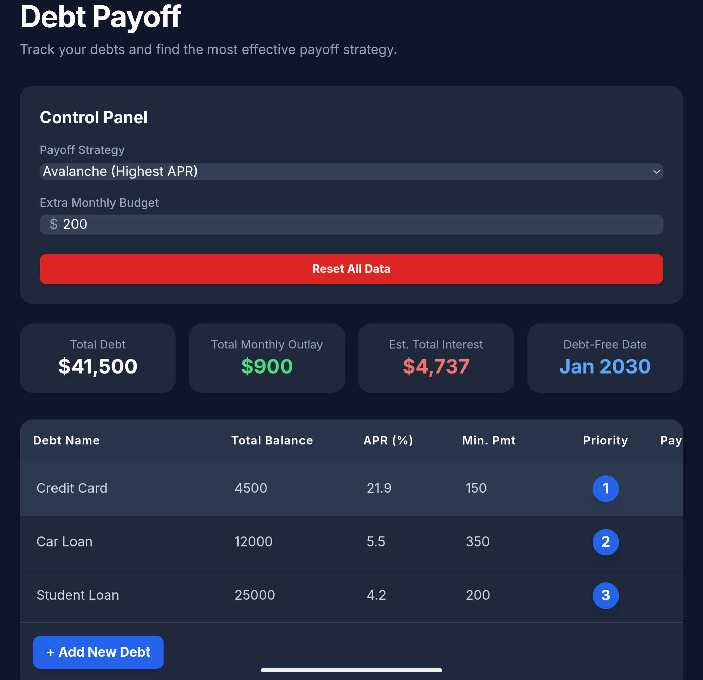

# Debt Payoff

## What It Is

Debt Payoff is a single-file, interactive web application designed to help you track your debts and find the most effective payoff strategy for your financial goals. It's a powerful financial calculator that runs entirely in your web browser, requiring no installation or internet connection after the initial file is saved.

This tool allows you to input all of your debts (credit cards, car loans, mortgages, etc.) and instantly compare three popular payoff methods to see which one will save you the most money, get you out of debt the fastest, or free up your monthly cash flow most effectively. All data you enter is saved locally and privately in your browser's storage.

## How It Works

Using the dashboard is straightforward:

1.  **Save the File:** Save the \`debt_payoff.html\` file to your computer.
2.  **Open in Browser:** Open the file in a modern web browser like Chrome, Firefox, or Edge.
3.  **Enter Your Debts:** The dashboard starts with sample data. You can edit these debts directly, delete them, or click the **"+ Add New Debt"** button to add your own. You'll need the current balance, the Annual Percentage Rate (APR), and the minimum monthly payment for each debt.
4.  **Set Your Budget:** In the "Control Panel," enter the extra amount you can afford to put towards your debts each month in the "Extra Monthly Budget" field.
5.  **Compare Strategies:** Use the "Payoff Strategy" dropdown menu to instantly switch between the three models and see how the results change in real-time.

All changes are saved automatically, so the next time you open the file, your data will be exactly as you left it.

## How You Can Benefit

Financial planning can be complex. This dashboard simplifies the process and empowers you to:

* **Make Informed Decisions:** Instantly see the long-term impact of different financial strategies. You can compare the **Debt Avalanche** (mathematically optimal for saving interest) against the **Debt Snowball** (psychologically motivating with quick wins) and a custom **Highest Payment** strategy to see which best fits your personality and goals.
* **Save Money:** By choosing the optimal strategy, you can see exactly how much money you will save in interest payments over the life of your loans—potentially thousands of dollars.
* **Find Your "Debt-Free Date":** The dashboard provides a realistic and motivating projection of the exact date you will be completely free from debt, based on the plan you've chosen.
* **Stay Motivated:** Visualizing the plan and seeing the payoff dates get closer can be a powerful motivator to stick to your budget and achieve your financial goals.

## The Core Simulation Logic

The power of this dashboard lies in its month-by-month payoff simulation. It doesn't just use simple formulas; it runs a detailed, iterative process to accurately model how your payments will affect your debts over time.

Here’s a simplified breakdown of how it works for each month in the simulation:

1.  **Identify the Target:** Based on the strategy you selected (e.g., highest APR, lowest balance), the simulation identifies the single debt that should receive all extra payments for that month.
2.  **Calculate the "Snowball":** The simulation calculates the total "snowball" payment available. This is the sum of:
    * Your "Extra Monthly Budget."
    * The minimum payments of **all debts that have already been paid off** in previous months. This is the key to the rollover effect, as the snowball grows larger every time a debt is eliminated.
3.  **Apply Payments:**
    * The entire snowball amount is added to the minimum payment of the **target debt**.
    * All other active debts receive their standard minimum payment.
4.  **Calculate Interest & New Balances:** For every active debt, the simulation calculates the interest accrued for the month and subtracts the payment made to determine the new balance.
5.  **Check for Payoffs:** The simulation checks if any debt's balance has dropped to or below zero. If so, it marks the debt as "paid off" and records the current month as its payoff date. The minimum payment from this debt will now be included in the snowball calculation in the *next* month.
6.  **Holistic Viability Check:** The simulation calculates the total interest accrued across *all* debts and compares it to the total payments made. As long as total payments exceed total interest, the plan is viable, and the simulation proceeds to the next month. This prevents failures when a single non-target debt might temporarily have its balance increase, even while the overall debt is shrinking.
7.  **Repeat:** This process repeats month after month until all debts are paid off, giving you a complete and accurate picture of your debt-free journey.

## Disclaimer

This tool is provided for educational and informational purposes only. It is offered "as is," without any warranty of any kind, express or implied.

The simulation engine provides estimates based on the data you enter. No claims are made regarding the accuracy, completeness, or suitability of these projections for your individual financial situation. The calculations do not account for factors such as variable interest rates, fees, or changes in payment amounts.

This dashboard is not a substitute for professional financial advice. Always verify the calculations and consult with a qualified financial professional before making any financial decisions. The creator of this tool assumes no liability for any actions taken or not taken based on the information provided herein.
